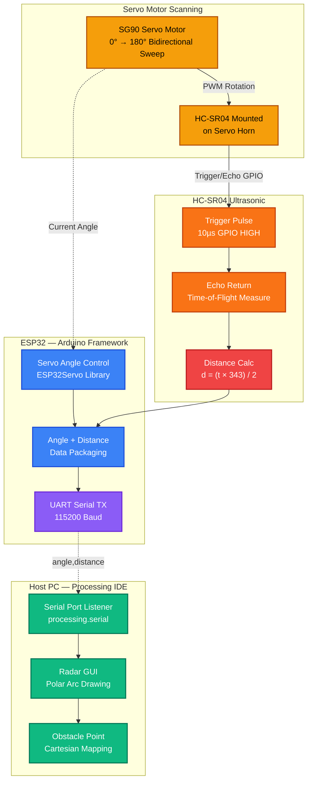

# Real-Time 2D Radar Mapping System Prototype

Real-Time 2D Radar Mapping using ESP32, HC-SR04 Ultrasonic Sensor, Servo Motor, UART and Processing IDE.

## Project Domain
Embedded Systems | Sensor Interfacing | Real-Time Data Acquisition | Java Visualization | Obstacle Detection | Basic ADAS Perception Prototype

## Overview
This project is a real-time scanning obstacle detection and 2D spatial visualization prototype that emulates the working principle of a low-cost radar perception system. An HC-SR04 ultrasonic sensor is mounted on a servo motor to perform bidirectional angular scanning across a 180° range. At each angular position, the sensor measures obstacle distance using ultrasonic time-of-flight. The ESP32 transmits the angle-distance pair over UART serial, and a Java-based Processing IDE application plots the incoming values on a radar-style GUI to produce a live 2D obstacle map.

**Sensing pipeline:**
```
ANGULAR SCAN → DISTANCE MEASUREMENT → UART DATA STREAM → 2D SPATIAL VISUALIZATION
```

## Problem Statement
A single fixed ultrasonic sensor provides only one-dimensional frontal distance information. Practical perception systems require environmental awareness across multiple directions. This project solves that by rotating the sensor through angular positions and building a visual obstacle map, converting a point detector into a spatial scanning detector.

## System Architecture



## Hardware Components

| Component | Connection | Role |
|---|---|---|
| ESP32 Dev Board | — | Main controller |
| HC-SR04 | TRIG → GPIO5, ECHO → GPIO18 | Ultrasonic distance sensing |
| SG90 Servo Motor | Signal → GPIO13 | Angular sweep mechanism |
| USB Cable | ESP32 → PC | UART serial bridge |
| Breadboard + Wires | — | Prototyping interconnects |

## Wiring Summary
- **HC-SR04:** VCC → 5V, GND → GND, TRIG → GPIO5, ECHO → GPIO18
- **Servo:** VCC → 5V, GND → GND, Signal → GPIO13
- **Power:** ESP32 powered via USB from host PC

## How It Works

1. ESP32 commands servo to rotate to a specific angle via PWM
2. At each angle, a 10µs trigger pulse fires the HC-SR04
3. The sensor emits an ultrasonic burst and measures echo return time
4. ESP32 computes distance: `d = (duration × 0.034) / 2` (cm)
5. ESP32 transmits `angle,distance` over UART (e.g. `45,120`)
6. Processing IDE receives the serial packet
7. The Java GUI converts polar coordinates to screen position and plots the obstacle point
8. Servo sweeps 0° → 180° → 0° continuously, refreshing the radar map

**Distance formula:**
```
Distance (cm) = (Echo pulse duration µs × Speed of Sound) / 2
              = (duration × 0.034) / 2
```

## PWM and Servo Angle

Standard servo PWM timing:
| Pulse Width | Angle |
|---|---|
| 1.0 ms | 0° |
| 1.5 ms | 90° |
| 2.0 ms | 180° |

## UART Data Packet Format
```
<angle>,<distance_cm>\n

Example:
45,120
90,35
135,200
```

## Project Structure
```
2d-radar-mapping-avr/
├── arduino/
│   └── radar_sensor/
│       └── radar_sensor.ino    # ESP32 Arduino sketch
├── processing/
│   └── RadarDisplay/
│       └── RadarDisplay.pde    # Processing IDE Java radar GUI
└── README.md
```

## Arduino Sketch — radar_sensor.ino
- Controls the servo sweep using `ESP32Servo` library
- Fires HC-SR04 trigger pulse and measures echo via `pulseIn()`
- Transmits `angle,distance` packets over `Serial` at 115200 baud
- Bidirectional sweep: 0° → 180° → 0° continuously

**Required Library:** `ESP32Servo` (install via Arduino Library Manager)

## Processing IDE Sketch — RadarDisplay.pde
- Opens the serial COM port at 115200 baud
- Parses incoming `angle,distance` packets
- Draws concentric radar arc grid with range labels
- Animates a green sweep line matching current servo angle
- Plots detected obstacle points in red at their polar position
- Refreshes continuously for live spatial visualization

**Required:** Processing IDE 4.x with `processing.serial` library (included by default)

## Running the Project
1. Flash `radar_sensor.ino` to ESP32 via Arduino IDE
2. Note the COM port from Arduino IDE
3. Open `RadarDisplay.pde` in Processing IDE
4. Update `Serial.list()[0]` to match your COM port index if needed
5. Run the Processing sketch — radar GUI launches automatically

## Automotive Relevance
This project demonstrates simplified concepts behind parking assist detection, short-range collision warning, blind-spot proximity sensing, and basic ADAS environmental scanning. Real automotive ADAS uses radar and LiDAR, but the core sensing pipeline — scan → acquire → process → visualize — remains identical.

## Limitations
- Ultrasonic is not true RF radar; affected by surface reflection angle
- Slower sweep speed compared to automotive radar systems
- Maximum reliable range ~2 metres in lab conditions
- Visualization runs on host PC (not standalone embedded display)

## Future Enhancements
- Replace HC-SR04 with TF-Mini LiDAR for longer range and higher accuracy
- Standalone TFT display on ESP32 (no PC dependency)
- Autonomous obstacle avoidance with motor control
- Multiple sensor fusion for wider field of view
- Motorized vehicle mount for mobile scanning
